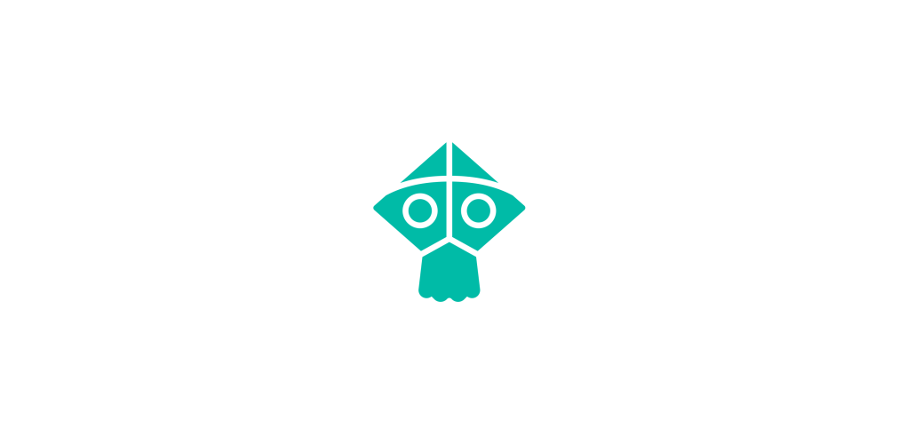

<a href="/" >
    
</a>

# Kite


Kite is a high-performance Connect Four solver capable of solving any board position within practical time bounds, even on modest hardware. It can be used to power AI bots with adjustable playing strength — from deliberately weak to perfectly optimal, making only provably best moves. Kite is suitable for building AI opponents, integrating into GUI applications, or analyzing positions programmatically.

Even **with the opening book disabled**, this solver can solve the empty board — the most difficult game state in Connect Four, as it represents the root of the game tree — in about 12 minutes on a modern laptop (using an *Intel i7-1165G7* processor) or in around *3 minutes and 26 seconds* on a modern desktop PC (using an *Intel i9-11900KF* processor).

Internally, Kite leverages **alpha-beta pruning**, **symmetry reduction**, **bitboards**, **position hashing** and **opening book lookups** to provide fast and accurate game tree evaluation.

---

## 🚀 Features

* **Alpha-Beta Pruning**: Reduces search space by skipping suboptimal branches early.
* **Symmetry Pruning**: Mirrored game states are considered equivalent and cached accordingly.
* **Move Ordering**: Uses heuristics that favor center columns and winning threats.
* **Bitboard Representation**: Game states use 64-bit integers for fast updates and operations.
* **Transposition Caching**: Hashes each position and stores scores in an efficient score cache.
* **Opening Book**: Stores lots of precomputed scores for early-game positions.
* *and much more...*

---

## 📦 Installation

Kite is available via **Maven Central** and can be easily added to any **Gradle** or **Maven** project.

### Gradle (Kotlin DSL)

Add the following code snippet to your `build.gradle.kts` file:

```kotlin
repositories {
    mavenCentral()
}

dependencies {
    implementation("io.github.tristan852:kite:1.2.2")
}
```

### Gradle (Groovy DSL)

Add the following code snippet to your `build.gradle` file:

```groovy
repositories {
    mavenCentral()
}

dependencies {
    implementation 'io.github.tristan852:kite:1.2.2'
}
```

### Maven

Add the following code snippet to your `pom.xml` file:

```xml
<repositories>
    <repository>
        <id>central</id>
        <url>https://repo.maven.apache.org/maven2</url>
    </repository>
</repositories>

<dependencies>
    <dependency>
        <groupId>io.github.tristan852</groupId>
        <artifactId>kite</artifactId>
        <version>1.2.2</version>
    </dependency>
</dependencies>
```

---

## 🚀 Getting Started

The Kite solver can be used by obtaining a newly created solver instance.
Note that each solver instance cannot be used by multiple threads in parallel.
If your project involves only a single game (even with multiple bots), a single solver instance is sufficient. However, if you're running multiple games in parallel, each game will need its own solver instance to avoid delays caused by mutual exclusion. In that case, the best approach is to recycle solver instances when possible and create new ones as needed.

The first time a Kite solver instance is obtained, a warm-up and additional initialization is done, which may take a bit of time.

The following code snippet demonstrates how the Kite solver should ideally be used:

```java
// obtain access to a new Kite solver instance
Kite solver = Kite.createInstance();

// Newly created solver instances will
// have the empty board state set up.
// Playing new moves will therefore add
// them in sequence to the empty board.

// red plays in the 4th column
// and yellow plays in the 6th column
solver.playMoves(4, 6);

// it is now red's turn, and they are going
// to win with their second to last stone
System.out.println(solver.evaluateBoard()); // = 2

// red plays in the 5th column
solver.playMove(5);

// it is now yellow's turn

// if yellow plays in the 6th column they
// are going to win with their last stone
System.out.println(solver.evaluateMove(6)); // = 1

// print a string representation
// of the current game state

// .......
// .......
// .......
// .......
// .......
// ...XXO.
// 
// moves: 465
// move scores: -3, 0, -2, +2, 0, +1, -2
// outcome: UNDECIDED
System.out.println(solver.boardString());

// clear the board (i.e. go back to
// the starting game state)
solver.clearBoard();
```

Please keep in mind that Java classes are being loaded lazily.

```java
// a class that is not used during program startup
public class A {
	
	private static final Kite SOLVER = Kite.createInstance();
	
}
```

In the above setup, if class `A` is not loaded at program startup, but rather at some later point, the solver instance creation and initialization will also not happen at startup, but rather when you first use class `A`, which might introduce an unwanted delay before your first use of the solver instance.

In the following class, the method `onProgramStartup` is assumed to be called when your program is booting up. The method obtains a reference to a new solver instance, which ensures that the solver is already initialized and ready to go after your program has started.

```java
public class B {
	
	private static Kite solver;
	
	// a method that is called during program startup
	public void onProgramStartup() {
		solver = Kite.createInstance();
	}
	
}
```

---

## 🕹️ Try It Out
Want to quickly try out the Kite solver? Here's a simple demo class that pits you against the solver using a fixed skill level:

```java
import net.kite.board.outcome.BoardOutcome;
import net.kite.skill.level.SkillLevel;

import java.util.Random;
import java.util.Scanner;
import java.util.concurrent.ThreadLocalRandom;

public class Main {
	
	// opponent of skill level six
	private static final SkillLevel OPPONENT_SKILL_LEVEL = SkillLevel.SIX;
	
	public static void main(String[] programArguments) {
		// initialize a new solver instance and a scanner
		Kite solver = Kite.createInstance();
		Scanner scanner = new Scanner(System.in);
		
		// randomly choose who goes first
		Random random = ThreadLocalRandom.current();
		if(random.nextBoolean()) solver.playMove(solver.skilledMove(OPPONENT_SKILL_LEVEL));
		
		System.out.println(solver.boardString());
		
		while(true) {
			
			System.out.println("Enter your move");
			int x = scanner.nextInt();
			
			if(!solver.moveLegal(x)) {
				
				System.err.println("Illegal move!");
				return;
			}
			
			solver.playMove(x);
			
			if(solver.gameOver()) {
				
				System.out.println(solver.boardString());
				System.out.println(solver.gameOutcome() == BoardOutcome.DRAW ? "You drew." : "You won!");
				return;
			}
			
			solver.playMove(solver.skilledMove(OPPONENT_SKILL_LEVEL));
			System.out.println(solver.boardString());
			
			if(solver.gameOver()) {
				
				System.out.println(solver.gameOutcome() == BoardOutcome.DRAW ? "You drew." : "You lost!");
				return;
			}
		}
	}
	
}
```

---

## 🧠 Evaluation Scale

Kite uses the following score metric to represent the value of a board or a move under perfect play:

| Evaluation score | Interpretation                                                                                                                                                |
|------------------|---------------------------------------------------------------------------------------------------------------------------------------------------------------|
| `0`              | The position is a guaranteed draw if both players play perfectly.                                                                                             |
| `n > 0`          | The current player will win, assuming perfect play, by placing their `n`th-to-last stone — the fastest possible win against perfect defense in this position. |
| `n < 0`          | The opponent will win, assuming perfect play, by placing their `-n`th-to-last stone — the fastest possible win against perfect defense in this position.      |

**Examples:**

* A score of `1` means the player to move can win, but only with their final stone.
* A score of `-2` means the opponent will win, and they will still have one stone remaining after the win.

---

## ⚔️ Skill levels

The Kite solver is capable of not only playing perfectly but also generating moves at fixed skill levels.
Its API supports thirteen distinct skill levels, ranging from `SkillLevel.RANDOM` up to `SkillLevel.PERFECT`, including intermediate levels like `SkillLevel.ONE`, `SkillLevel.TWO`, ..., and `SkillLevel.TEN`.

These skill levels are ordered by increasing playing strength, with each level designed to be stronger than the previous one.
A special skill level, `SkillLevel.ADAPTIVE`, adjusts move selection to match the opponent's playing strength.
You can use all available skill levels or choose a subset that fits your project.

The matrix below illustrates how each skill level (excluding `SkillLevel.ADAPTIVE`) performs against the others.

| **vs**.     | **Random**                         | **One**                            | **Two**                            | **Three**                          | **Four**                           | **Five**                           | **Six**                            | **Seven**                          | **Eight**                          | **Nine**                           | **Ten**                                | **Perfect**                            |
|-------------|------------------------------------|------------------------------------|------------------------------------|------------------------------------|------------------------------------|------------------------------------|------------------------------------|------------------------------------|------------------------------------|------------------------------------|----------------------------------------|----------------------------------------|
| **Random**  | <span style="opacity:0.5">-</span> | 16.8%                              | 13.1%                              | 9.4%                               | 8.1%                               | 4.0%                               | 2.3%                               | 0.5%                               |                                    |                                    |                                        |                                        |
| **One**     | 83.2%                              | <span style="opacity:0.5">-</span> | 42.6%                              | 36.2%                              | 29.8%                              | 19.0%                              | 12.0%                              | 5.3%                               | 1.4%                               |                                    |                                        |                                        |
| **Two**     | 86.6%                              | 57.1%                              | <span style="opacity:0.5">-</span> | 40.9%                              | 36.4%                              | 23.9%                              | 13.0%                              | 6.1%                               | 0.9%                               |                                    |                                        |                                        |
| **Three**   | 90.5%                              | 63.6%                              | 58.8%                              | <span style="opacity:0.5">-</span> | 40.0%                              | 28.8%                              | 18.1%                              | 8.3%                               | 2.4%                               |                                    |                                        |                                        |
| **Four**    | 91.7%                              | 69.9%                              | 63.3%                              | 59.6%                              | <span style="opacity:0.5">-</span> | 37.8%                              | 24.9%                              | 14.0%                              | 3.6%                               |                                    |                                        |                                        |
| **Five**    | 95.7%                              | 80.8%                              | 75.6%                              | 70.4%                              | 61.7%                              | <span style="opacity:0.5">-</span> | 38.9%                              | 17.2%                              | 5.7%                               | 0.5%                               |                                        |                                        |
| **Six**     | 97.6%                              | 87.9%                              | 86.7%                              | 81.8%                              | 74.6%                              | 60.4%                              | <span style="opacity:0.5">-</span> | 30.7%                              | 8.6%                               | 0.7%                               |                                        |                                        |
| **Seven**   | 99.3%                              | 94.5%                              | 93.3%                              | 91.5%                              | 85.7%                              | 82.0%                              | 67.9%                              | <span style="opacity:0.5">-</span> | 22.5%                              | 2.5%                               |                                        |                                        |
| **Eight**   |                                    | 98.6%                              | 98.4%                              | 97.3%                              | 95.9%                              | 92.7%                              | 88.9%                              | 73.9%                              | <span style="opacity:0.5">-</span> | 8.2%                               |                                        |                                        |
| **Nine**    |                                    |                                    |                                    |                                    |                                    | 99.2%                              | 98.2%                              | 95.2%                              | 86.3%                              | <span style="opacity:0.5">-</span> | 1.0%                                   | 1.0%                                   |
| **Ten**     |                                    |                                    |                                    |                                    |                                    |                                    |                                    |                                    |                                    | 95.8%                              | <span style="opacity:0.5">-</span>     | <span style="opacity:0.5">50.0%</span> |
| **Perfect** |                                    |                                    |                                    |                                    |                                    |                                    |                                    |                                    |                                    | 95.8%                              | <span style="opacity:0.5">50.0%</span> | <span style="opacity:0.5">-</span>     |

For example, the table shows that `SkillLevel.TEN` wins *95.8%* of its matches against the `SkillLevel.NINE` bot, loses *1%*, and draws the remaining *3.2%*.
Draws are generally rare between bots of different skill levels.

For clarity, one-sided matchups — where the stronger level consistently wins 100% of the time — have been omitted from the table.

Since `SkillLevel.TEN` always plays perfectly — and Connect Four is a first-player win under perfect play — matches between `SkillLevel.TEN` and `SkillLevel.PERFECT` are determined solely by who gets to move first, resulting in a *50/50* outcome.

By using the win, loss, and draw probabilities for each pair of skill levels from the table above, we can estimate an [Elo rating](https://en.wikipedia.org/wiki/Elo_rating_system) for each level:

| Skill level | Elo rating estimate |
|-------------|---------------------|
| Random      | 1000                |
| One         | 1285                |
| Two         | 1329                |
| Three       | 1382                |
| Four        | 1443                |
| Five        | 1536                |
| Six         | 1636                |
| Seven       | 1789                |
| Eight       | 2006                |
| Nine        | 2380                |
| Ten         | 3005                |
| Perfect     | 3005                |

An Elo rating difference of approximately *400* corresponds to a *91%* win rate for the higher-rated player.
This aligns well with the empirical results from the first table when compared to the rating estimates in the second.

For reference, the Elo ratings have been normalized so that the `SkillLevel.RANDOM` bot has a rating of *1000*.
Since `SkillLevel.TEN` and `SkillLevel.PERFECT` represent the same level of play, they share the same rating estimate.

Notably, the Elo gaps between successive skill levels widen as we approach perfect play. This trend is also reflected in the first table, where matchups become increasingly one-sided.
This reflects the fact that at high levels, even a single small mistake can be decisive — making further improvements increasingly difficult and more impactful in terms of rating.

If you want to translate these Elo ratings to your own scale — or vice versa — try to identify a reference point by comparing one of these skill levels to a skill level in your system with a known Elo rating.

---

## 📄 License

Kite is licensed under the [GNU General Public License v3.0](https://www.gnu.org/licenses/gpl-3.0.html).

You are free to use, modify, and distribute this software under the terms of the GPL-3.0. However, if you distribute a modified version or derivative work, it must also be licensed under the GPL-3.0 and include the source code.

For full terms, see the [LICENSE](./LICENSE) file.
